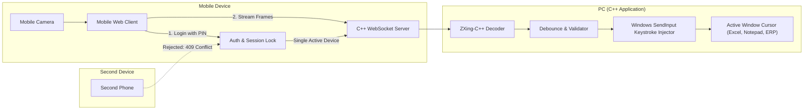

# Mobile Barcode Scanner to PC Keystroke Wedge (ZXing-C++)

## 1. System Architecture Overview



### Why the Zero-Install Web Client Approach?
- **No app installation needed**: Any Android or iOS device connects instantly by scanning a QR code shown on the PC screen.
- **Cross-platform mobile**: Works in Safari, Chrome, Edge using `navigator.mediaDevices.getUserMedia()`.
- **ZXing-C++ on PC**: Heavy decoding, multiple barcode format filtering, image thresholding, and configuration are all handled in high-performance C++.

---

## 2. Core Components & Technology Stack

| Layer | Component | Recommended Technology | Purpose |
| :--- | :--- | :--- | :--- |
| **Language & Build** | C++20 | CMake + vcpkg / FetchContent | Modern C++, easy dependency management on Windows |
| **Barcode Engine** | ZXing-C++ | `zxing-cpp` (v2.2+) | Fast, multi-format 1D/2D barcode detection from raw buffers |
| **Server & Network** | Embedded HTTP/WS Server | `cpp-httplib` + `nlohmann/json` (or `uWebSockets` / `Crow`) | Serves mobile web UI and receives binary image frames over WebSocket |
| **Auth & Session Lock** | Single-Device Mutex | In-memory Token + Atomic Session Lock | Ensures only one authenticated device can connect at a time |
| **Input Emulation** | Keystroke Wedge | Windows API `SendInput` (`KEYEVENTF_UNICODE`) | Injects scanned characters into whichever window has active focus |
| **Mobile Client** | Web UI (Single Page) | HTML5 Canvas + WebRTC Camera Stream | Captures video frames at 15–30 FPS and forwards compressed JPEG/WebP or raw frames |

---

## 3. Single-Device Login & Session Lock Architecture

To prevent interference and ensure only one operator controls the cursor at any given time, the server implements an exclusive single-device session lock:

### A. Pairing PIN & Token
1. **Dynamic Session PIN**: On startup, the PC server generates a 4-digit PIN (e.g., `4829`) displayed on the PC screen and embedded in the pairing QR code (`http://<PC-IP>:<PORT>/?pin=4829`).
2. **One-Tap Login**: Scanning the pairing QR automatically passes the PIN and authenticates.
3. **Manual Login Form**: If typed directly in the mobile browser, the mobile UI presents a clean PIN entry screen.

### B. Exclusive Device Lock (Mutex)
- The C++ server maintains an atomic session state:
  ```cpp
  struct DeviceSession {
      std::string sessionId;
      std::string clientIp;
      std::chrono::steady_clock::time_point lastHeartbeat;
      bool isActive = false;
  };
  ```
- **When Device 1 authenticates**:
  - If `isActive == false`: The server locks the session to Device 1, issues a session token, and accepts the WebSocket stream.
  - PC status updates: `[STATUS] Scanner Connected: 192.168.1.50`.
- **When Device 2 attempts to login**:
  - The server detects `isActive == true` and immediately rejects the login request with:
    `"Session In Use: Another device (192.168.1.50) is currently connected as the active scanner."`
  - Device 2 is blocked from opening the camera stream or transmitting scans.

### C. Graceful Release & Auto-Disconnect (Liveness Heartbeat)
- **Manual Disconnect**: Mobile client includes a "Disconnect" button to voluntarily release the lock.
- **WebSocket Heartbeat (Ping/Pong)**: Client sends a heartbeat ping every 3 seconds.
- **Stale Session Expiry**: If a phone screen turns off, browser closes, or Wi-Fi drops, the PC detects missed heartbeats (> 6 seconds) and automatically frees the session lock.
- **PC Operator Override**: Pressing `K` (Kick) on the PC console immediately revokes the current mobile session.

---

## 4. Detailed Data Flow & Processing Pipeline

### Step 1: Pairing & Authentication
1. C++ PC Server starts, determines its local LAN IP (e.g., `192.168.1.45:8080`), generates PIN `5812`.
2. Server prints pairing QR code in the terminal or GUI window.
3. User scans QR code with phone, opening `http://192.168.1.45:8080/?pin=5812`.
4. Server validates PIN, checks `isActive == false`, grants session token, and establishes authenticated WebSocket (`ws://.../stream?token=...`).

### Step 2: Frame Capture & Transport
1. Mobile camera initializes via `navigator.mediaDevices.getUserMedia({ video: { facingMode: "environment" } })`.
2. A client-side canvas captures frames at throttled intervals (e.g., every 80–120ms to save battery and network bandwidth).
3. Frame is sent as binary data (JPEG / raw image bytes) over the authenticated WebSocket.

### Step 3: ZXing-C++ Decoding
1. Server receives binary buffer, decompresses/wraps it into `ZXing::ImageView`:
   ```cpp
   ZXing::ImageView image(buffer.data(), width, height, ZXing::ImageFormat::Lum);
   auto hints = ZXing::DecodeHints()
       .setFormats(ZXing::BarcodeFormat::Any)
       .setTryHarder(true)
       .setTryRotate(true);
   auto result = ZXing::ReadBarcode(image, hints);
   ```
2. If `result.isValid()`:
   - Check **debounce / deduplication cache** (prevent re-typing the exact same barcode if scanned continuously within a 1.5s window).
   - Send an audio/vibration feedback trigger packet back to the phone (`navigator.vibrate(100)`).

### Step 4: Keyboard Simulation (Virtual Wedge)
Scanned text is injected into the active foreground window using Windows `SendInput`:
```cpp
void TypeString(const std::wstring& text, bool sendEnter = true) {
    std::vector<INPUT> inputs;
    for (wchar_t ch : text) {
        INPUT input = {};
        input.type = INPUT_KEYBOARD;
        input.ki.wScan = ch;
        input.ki.dwFlags = KEYEVENTF_UNICODE;
        inputs.push_back(input);

        input.ki.dwFlags = KEYEVENTF_UNICODE | KEYEVENTF_KEYUP;
        inputs.push_back(input);
    }
    if (sendEnter) {
        INPUT enterDown = {}, enterUp = {};
        enterDown.type = enterUp.type = INPUT_KEYBOARD;
        enterDown.ki.wVk = enterUp.ki.wVk = VK_RETURN;
        enterUp.ki.dwFlags = KEYEVENTF_KEYUP;
        inputs.push_back(enterDown);
        inputs.push_back(enterUp);
    }
    SendInput(static_cast<UINT>(inputs.size()), inputs.data(), sizeof(INPUT));
}
```

---

## 5. Key Engineering Considerations & Edge Cases

1. **Unicode vs ScanCode**:
   - Using `KEYEVENTF_UNICODE` prevents issues with different keyboard layouts (QWERTY vs AZERTY) and preserves special characters and non-ASCII text.
2. **Duplicate Suppression (Debounce)**:
   - Barcode scanners in video mode see 20+ frames per second. Without a cooldown timer (e.g., 1000–2000ms for identical content), a single scan would paste the same code 15 times.
3. **Audio / Haptic Feedback**:
   - Real hardware scanners provide an audible "beep" and green flash. The mobile web page buzzes the phone's haptic motor and plays a short audio chime on scan confirmation.
4. **Local Network Camera Permissions**:
   - Modern mobile browsers require a secure context (HTTPS) for `getUserMedia` across Wi-Fi IPs.
   - The C++ server can self-serve an embedded TLS certificate or support reverse proxy / Chrome flag (`#unsafely-treat-insecure-origin-as-secure`) for zero-hassle local network access.
5. **Configurable Output Suffix**:
   - Suffix options: `ENTER` (default for forms and inventory lists), `TAB` (for jumping table cells), or `NONE`.

---

## 6. Project Implementation Milestones

- [ ] **Phase 1: Project Setup & Dependencies**
  - Setup CMake project with `zxing-cpp`, `cpp-httplib` (or WebSocket server), and `stb_image`.
- [ ] **Phase 2: Authentication & Single-Device Session Lock**
  - PIN generation, QR code generation, session token management.
  - Mutex enforcement: reject 2nd device with 409 Conflict.
  - Heartbeat / disconnect timeout handler.
- [ ] **Phase 3: ZXing-C++ Wrapper & Keystroke Injector**
  - Implement barcode reader module with image buffer input.
  - Implement Windows `SendInput` typing utility with debounce logic.
- [ ] **Phase 4: Web Server & Mobile Camera Interface**
  - Embedded mobile web page with PIN login, camera viewfinder, and WebSocket frame streamer.
  - Audio beep and haptic feedback on successful scan.
- [ ] **Phase 5: Testing & Polish**
  - Verify with standard retail barcodes (EAN-13, UPC), warehouse barcodes (Code 128, Code 39), and QR / DataMatrix codes.
  - Test single-device lock rejection by attempting to connect from two phones simultaneously.
  - Test cursor typing in Notepad, Excel, and ERP web forms.
